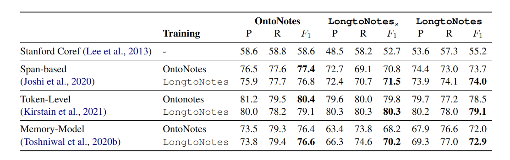

# LongtoNotes
### LongtoNotes: OntoNotes with Longer Coreference Chains

[Ontonotes](https://catalog.ldc.upenn.edu/LDC2013T19) has served as the most important benchmark for coreference resolution. However, for ease of annotation, several long documents in Ontonotes were split into smaller parts.
In this work, we build a corpus of coreference-annotated documents of significantly longer length than what is currently available.
We do so by providing an accurate, manually-curated, merging of annotations from documents that were split into multiple parts in the original Ontonotes annotation process Ontonotes.
The resulting corpus, which we call **LongtoNotes** contains documents in multiple genres of the English language with varying lengths, the longest of which are up to 8x the length of documents in Ontonotes, and 2x those in [Litbank](https://github.com/dbamman/litbank).

---

## Comparison to other coref datasets

---

## Model performance on OntoNotes vs LongtoNotes

---

 LongtoNotes is licensed under a <a rel="license" href="http://creativecommons.org/licenses/by/4.0/">Creative Commons Attribution 4.0 International License</a>. However, access to OntoNotes is needed in order to create LongtoNotes from it. 

**For access to LongtoNotes now, please reach out to us** (shkumar@ethz.ch). We will soon release the automatic script to convert OntoNotes into LongtoNotes.

---

